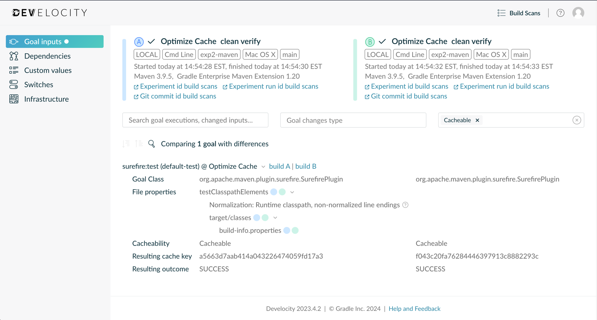

# DPE University Training

[](https://dpeuniversity.gradle.com/)
Checkout all the **free** Maven, Gradle, and DPE courses at the [DPE University][dpe-university]!

## Maintaining an Optimized Maven Build Cache - Lab

This is a hands-on exercise to go along with the [Maintaining Optimal Maven Build Cache Performance][course-url] training module. In this exercise you will go over how to monitor for build cache misses using [build-validation-scripts][build-validation-scripts]. These scripts will run two builds and then check for cache misses between them.
These scripts can be run locally and via CI. We recommend configuring your CI system to run them at least weekly.  This repository demonstrates how to do this with GitHub Actions, but the instructions would be similar for any other CI system.

## Prerequisites

- Finished going through the _Maintaining an Optimized Build Cache_ section in the [Maintaining Optimal Maven Build Cache Performance][course-url] course.
- Java 11+

Steps
-----

1. Clone this repository and change to its directory.

2. If you have not completed other DPE University Maven labs, authenticate Maven with the Develocity server.

> [!NOTE]
> As part of taking this **free** course, you have access to a training instance of Develocity located at:
> ```
>  https://dpeuniversity-develocity.gradle.com/
>  ```
> [Sign in][develocity-url] to this Develocity server using the same account you use for the DPE University.
>
> This server is configured so users can only access the Build Scan® and Build Cache entries they publish.

Run the following command and follow the instructions in your terminal:

 ```shell
 ./mvnw com.gradle:gradle-enterprise-maven-extension:provision-access-key
 ```
> [!NOTE]
> For more ways to authenticate, see the [authentication guide](https://docs.gradle.com/enterprise/maven-extension/#authenticating_with_gradle_enterprise) to see how to provide credentials.

3. Notice how `pom.xml` filters the build timestamp into `src/main/resources/build-info.properties`, this will create a build cache miss.

> [!TIP]
> This lab focuses on, running the Build Validation Scripts. We go into more detail on how to normalize (workaround) this type of build cache miss in the [Build Cache Deep Dive course][build-cache-course].

4. Set shell variables to containing the version and checksum:
    
    ```shell
    version="2.5.1"
    # You can find the SHA 512 checksum on the releases page:
    # https://github.com/gradle/gradle-enterprise-build-validation-scripts/releases
    checksum="131fb1a0de2409d7f1747bd0da75680e757d791596a81f43787f36badf40f1385aa593ab053c1b396a1bcbf6b9da64cc355e78c04eb55ff5d0a6526a5f318e54"
    ```

> [!NOTE]
> As of this writing the version of the Build Validation Scripts is `2.5.1`, check the [Build Validation Scripts repository][build-validation-scripts] for the latest version.

5. Download and extract the build validation scripts zip file:

    ```shell
    # Download and extract in temp directory
    pushd /tmp
    # Download scripts zip
    curl -s -L -O "https://github.com/gradle/gradle-enterprise-build-validation-scripts/releases/download/v${version}/gradle-enterprise-maven-build-validation-${version}.zip"
    # Verify zip
    echo "${checksum}  gradle-enterprise-maven-build-validation-${version}.zip" | shasum -a 512 -c-
    # Extract Build Validation Scripts
    unzip -q -o gradle-enterprise-maven-build-validation-${version}.zip
    popd
    ```

6. Execute the build validation script to run two build in different directories:

    ```shell
    /tmp/gradle-enterprise-maven-build-validation/02-validate-local-build-caching-different-locations.sh \
      --git-repo "$(pwd)" \
      --goals verify \
      --fail-if-not-fully-cacheable
    ```

    After both builds finish you will see Summary and Investigation Quick Links sections, click on the "Goal inputs comparison" link, to view the differences in the inputs. Notice that the `build-info.properties` file is different.

    

7. See the [`.github/workflows/cron-shell-script.yml`](.github/workflows/cron-shell-script.yml) to automate this process.

> [!NOTE]
> The above `cron-shell-script.yml`, performs each of the steps mentioned above to demonstrate how these steps could be run on any CI system.  If you are using GitHub Actions, these steps can be simplified by using a shared Action, see [`.github/workflows/cron-shared-action.yml`](.github/workflows/cron-shared-action.yml)

8. To see how to work around the build cache miss, see the commented out section in this project's `pom.xml`, or see the [dedicated lab](https://github.com/gradle/cache-misses-maven-build-cache-lab).

## More Free Labs & Courses

Be sure to check out our other **free** [courses][dpe-university] and [labs](https://github.com/gradle?q=dpe-university)!

**Related courses:**
- [Maven - Build Cache Deep Dive][build-cache-course]
- [Maven - Maintaining an Optimized Build Cache][course-url]
- [Develocity - How to Use Build Scans](https://dpeuniversity.gradle.com/c/0b0b3e4a8d21709ff39074e9962eee6ca4276dc1)

**Related labs:**
- [Lab 01 - Using the local build cache](https://github.com/gradle/getting-started-maven-build-cache-lab)
- [Lab 02 - Missing Inputs With Build Caching](https://github.com/gradle/missing-inputs-maven-build-cache-lab)
- [Lab 03 - Add Build Cache Support to any Maven Plugin](https://github.com/gradle/caching-any-plugin-maven-build-cache-lab)
- [Lab 04 - Handling Cache Misses with Normalization](https://github.com/gradle/cache-misses-maven-build-cache-lab)
- [Lab 05 - Outputs Overwrite Inputs](https://github.com/gradle/outputs-overwrite-inputs-maven-build-cache-lab)
- [Lab 06 - Maintaining an Optimized Build Cache](https://github.com/gradle/maintaining-optimized-cache-maven-build-cache-lab)

[course-url]: https://dpeuniversity.gradle.com/c/42cf9d626302011526c4a0536b26af929b5bef58
[dpe-university]: https://dpeuniversity.gradle.com/
[develocity-url]: https://dpeuniversity-develocity.gradle.com/
[build-cache-course]: https://dpeuniversity.gradle.com/c/47262fea1e74b719afb590d8cb3f8280bf2af732
[build-validation-scripts]: https://github.com/gradle/gradle-enterprise-build-validation-scripts